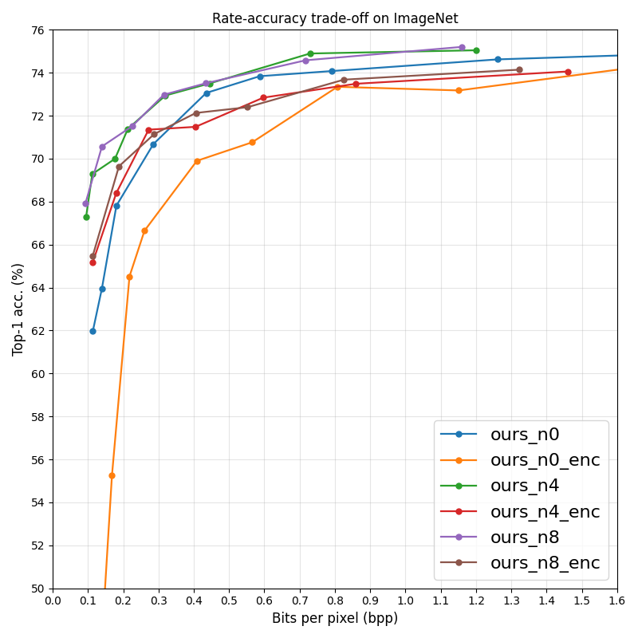

# Efficient Feature Compression for Edge-Cloud Systems

**Paper:** Efficient Feature Compression for Edge-Cloud Systems, published at Picture Coding Symposium (PCS) 2022 \
**Arxiv:** https://arxiv.org/abs/2211.09897

## Install
**Requirements**:
- `pytorch>=1.12`, `tqdm`, `compressai==1.2.2` ([link](https://github.com/InterDigitalInc/CompressAI))
- Code has been tested on Windows and Linux with Intel CPUs and Nvidia GPUs (Python 3.9, CUDA 11.3).

**Download**:
1. Download the repository;
2. Download the pre-trained model checkpoints and put them in the `checkpoints` folder.

**Pre-trained model checkpoints**:
|               | Latency | Link                                                                                               |
|---------------|---------|----------------------------------------------------------------------------------------------------|
| `ours_n0`     | 3.95ms  | [Google Drive](https://drive.google.com/file/d/1fmxiExP13TzUfNgvrnXfK3ApG8kSVLuf/view?usp=sharing) |
| `ours_n4`     | 6.70ms  | [Google Drive](https://drive.google.com/file/d/1rFoUs8r5obwz5KXJI00-DOunQE-uFrlO/view?usp=sharing) |
| `ours_n8`     | 10.2ms  | [Google Drive](https://drive.google.com/file/d/1_wijavWfihU3rnERAomr8KiDLMswZ_D3/view?usp=sharing) |
| `ours_n0_enc` | 3.95ms  | [Google Drive](https://drive.google.com/file/d/1gJAtdMvp8nMjlvzVL-_lUn2OvO0N3fa9/view?usp=sharing) |
| `ours_n4_enc` | 6.70ms  | [Google Drive](https://drive.google.com/file/d/1TtW76UY7-gDQ1miFRPWUhsKCG2fnLxZ2/view?usp=sharing) |
| `ours_n8_enc` | 10.2ms  | [Google Drive](https://drive.google.com/file/d/1vZfBoa4ZzvrRaJXDuNTZjUMbjIV0IZ88/view?usp=sharing) |

*Latency is the time to encode a `224x224` RGB image, including time for entropy coding. Device: Intel 10700k CPU, using 8 cores (default of PyTorch).




## Usage (TBD)
- **Feature compression**: See `example-sender.ipynb`.
- **Prediction from compressed feature**: See `example-receiver.ipynb`.


## Evaluation on ImageNet
Evaluate all models on ImageNet:
`python evalutate.py -d /path/to/imagenet/val -b batch_size -w cpu_workers`


## Training

### Preparation
- In `trian.py`, update `IMAGENET_DIR = Path('../../datasets/imagenet')` to the imagenet root directory;
- Install `wandb`: https://docs.wandb.ai/quickstart

### Train the model with name `ours_n4`
```
python train.py --model ours_n4
```
Supported models:
- `ours_n8`
- `ours_n8_enc`
- `ours_n4`
- `ours_n4_enc`
- `ours_n0`
- `ours_n0_enc`
- `matsubara2022wacv`

### Specify GPU id=4
```
CUDA_VISIBLE_DEVICES=4 python train.py --model ours_n4
```

### Specify `bpp_lmb`
```
CUDA_VISIBLE_DEVICES=4 python train.py --model ours_n4 --model_args bpp_lmb=0.64
```
The training loss function is `loss = other_terms + lmb_bpp * bppix`:
- A larger `bpp_lmb` results in lower bpp but lower accuracy
- A smaller `bpp_lmb` results in higher bpp but higher accuracy


### Specify batch size
```
CUDA_VISIBLE_DEVICES=4 python train.py --model ours_n4 --model_args bpp_lmb=0.64 --batch_size 128
```
The default batch size is 384, which we used to train our models (we used 4 GPUs, 96 on each).
Lower batch size results in a faster training but probably worse final performance.


### Log training using Weights & Biases
```
CUDA_VISIBLE_DEVICES=4 python train.py --model ours_n4 --model_args bpp_lmb=0.64 --batch_size 128 --wbmode online
```
By default, the run locates at https://wandb.ai/home > "edge-cloud-rac" project > "default-group" group.
One can specify the project name and group name by `--wbproject` and `--wbgroup`


### Multi-GPU training, using four GPUs (id=4,5,6,7)
```
CUDA_VISIBLE_DEVICES=4,5,6,7 torchrun --nproc_per_node 4 train.py --model ours_n4 --model_args bpp_lmb=0.64 --batch_size 96 --wbmode online --ddp_find
```
Note: `--ddp_find` is necessary for using multi-GPU training (PyTorch DDP)


## License
TBD
